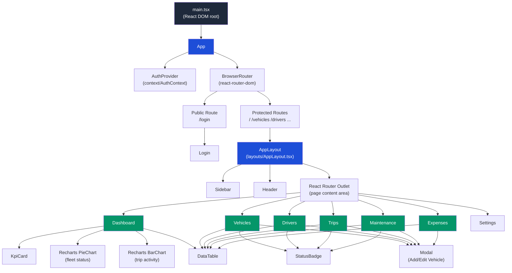
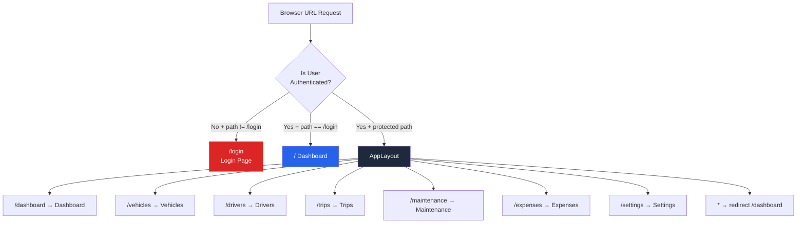
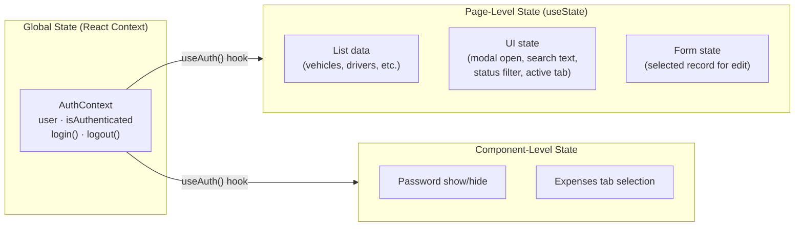
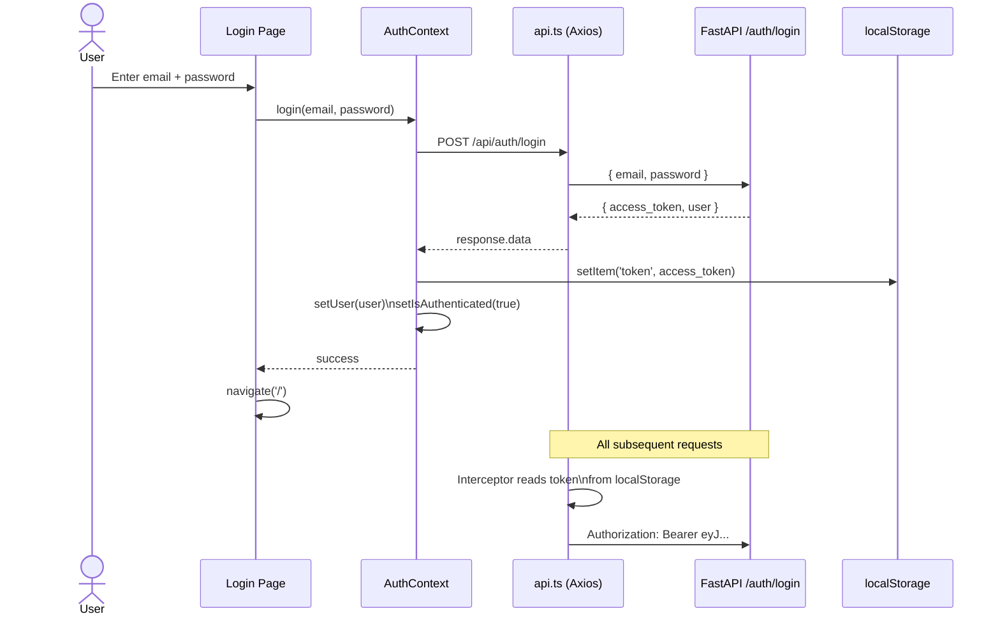
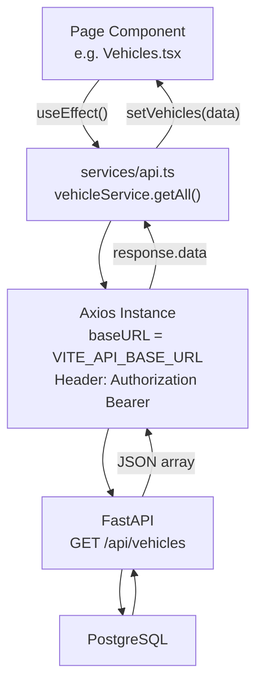
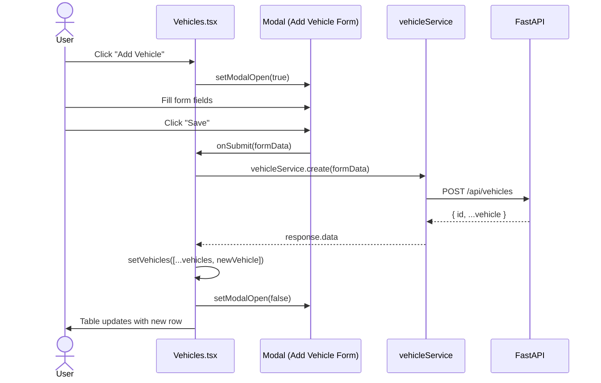
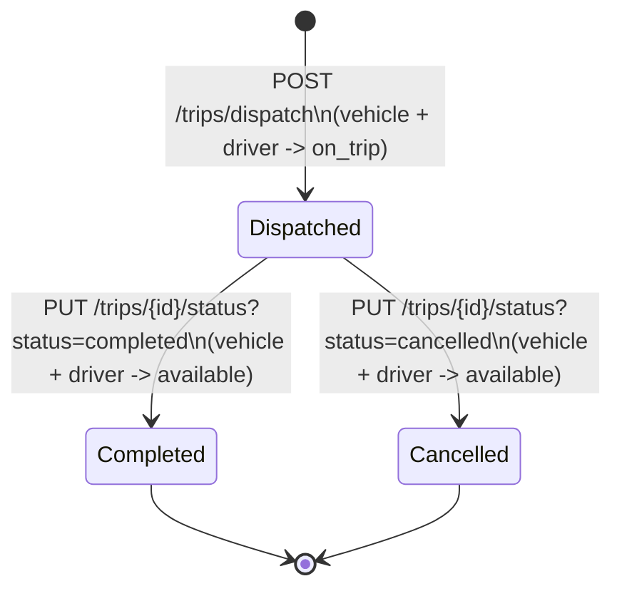

# TransitOps — Frontend Architecture

**Version:** 1.0.0
**Date:** 2026-07-12
**Stack:** React 18 · TypeScript 5 · Vite 5 · Tailwind CSS 3 · React Router 6 · Axios · Recharts · Lucide React

---

## Table of Contents

1. [Overview](#overview)
2. [Folder Structure](#folder-structure)
3. [Component Hierarchy](#component-hierarchy)
4. [Routing Architecture](#routing-architecture)
5. [State Management](#state-management)
6. [Authentication Flow](#authentication-flow)
7. [API Integration Pattern](#api-integration-pattern)
8. [Design System](#design-system)
9. [Data Flow Diagrams](#data-flow-diagrams)
10. [Mock → Real API Migration](#mock--real-api-migration)
11. [Settings Page (UI-only)](#11-settings-page-ui-only)

---

## 1. Overview

The TransitOps frontend is a **Single Page Application (SPA)** built with React and TypeScript. It communicates exclusively with the FastAPI backend via Axios HTTP calls using JWT Bearer tokens for authentication.

The UI is organized around a **fixed sidebar navigation** and a **scrollable main content area**, giving users access to 7 pages: Dashboard, Vehicles, Drivers, Trips, Maintenance, Expenses, and Settings (Settings is UI-only — see §11).

---

## 2. Folder Structure

```
frontend/src/
│
├── components/          # Shared, reusable UI primitives
│   ├── Sidebar.tsx      # Fixed left navigation bar
│   ├── Header.tsx       # Top bar with page title and user info
│   ├── KpiCard.tsx      # Dashboard metric card
│   ├── DataTable.tsx    # Generic typed table component
│   ├── StatusBadge.tsx  # Colored status pill
│   └── Modal.tsx        # Reusable dialog overlay
│
├── layouts/             # App shell wrappers
│   └── AppLayout.tsx    # Protected layout: Sidebar + Header + Outlet
│
├── context/             # React Context providers
│   └── AuthContext.tsx  # User auth state + login/logout methods
│
├── hooks/               # Custom React hooks
│   └── useAuth.ts       # Consumes AuthContext cleanly
│
├── types/               # TypeScript type definitions
│   └── index.ts         # All interfaces and type aliases (single source of truth)
│
├── data/                # Mock data for development
│   └── mockData.ts      # Realistic placeholder arrays for all entities
│
├── pages/               # Route-level page components
│   ├── Login.tsx        # Public auth page
│   ├── Dashboard.tsx    # KPI cards + charts + recent trips
│   ├── Vehicles.tsx     # Vehicle CRUD with search/filter
│   ├── Drivers.tsx      # Driver CRUD with search/filter
│   ├── Trips.tsx        # Trip management with status actions
│   ├── Maintenance.tsx  # Maintenance record management
│   ├── Expenses.tsx     # Fuel logs + other expenses
│   └── Settings.tsx     # Profile/Security forms — UI only, not wired to the backend (see §11)
│
├── services/            # API communication layer
│   └── api.ts           # Axios instance + all service functions
│
├── App.tsx              # Root router (public + protected routes)
├── main.tsx             # React DOM entry point
└── index.css            # Tailwind directives + global styles
```

### Design Principle: Separation of Concerns

| Folder | Responsibility | Who Changes It |
|---|---|---|
| `types/` | Shape of data | Backend integrator |
| `data/` | Mock values | Backend integrator (then deletes) |
| `services/` | HTTP calls | Backend integrator |
| `context/` + `hooks/` | Auth state | Auth owner |
| `components/` | Reusable UI | UI developer |
| `layouts/` | App shell | UI developer |
| `pages/` | Feature logic | Feature developers |

---

## 3. Component Hierarchy



---

## 4. Routing Architecture

React Router v6 manages all navigation with two route groups: **public** and **protected**.



### Route Configuration (actual, `App.tsx`)

```
Routes
├── /login             → <Login />                     (public — if already authenticated, redirects to /dashboard)
└── <ProtectedRoute><AppLayout /></ProtectedRoute>      (redirects to /login if not authenticated)
    ├── /dashboard      → <Dashboard />
    ├── /vehicles       → <Vehicles />
    ├── /drivers        → <Drivers />
    ├── /trips          → <Trips />
    ├── /maintenance    → <Maintenance />
    ├── /expenses       → <Expenses />
    ├── /settings       → <Settings />
    └── *                → <Navigate to="/dashboard" />
```

There is no route for bare `/` — it falls through to the `*` catch-all and redirects to `/dashboard` (or to
`/login` first, via `ProtectedRoute`, if not authenticated). `Settings.tsx` exists and is routed but is not
mentioned elsewhere in this document — see §11 below.

**Auth Guard:** a dedicated `ProtectedRoute` wrapper component (not `AppLayout` itself) reads
`isAuthenticated` from `useAuth()` and redirects to `/login` via `<Navigate replace>` if false — no page
reload required. `AppLayout` itself only renders the Sidebar/Header/Outlet shell.

---

## 5. State Management

TransitOps uses **no external state management library** (no Redux, no Zustand). State is managed at three levels:



### Why No Redux?

| Concern | Solution |
|---|---|
| Auth state shared globally | React Context (`AuthContext`) |
| Page data (vehicles list, etc.) | `useState` inside each page |
| Form data | Controlled `useState` inside modals |
| Cross-page data (vehicles list for Trip form) | Import from `mockData.ts` → later from API |

For a hackathon, Context + `useState` is the right tool. Redux would add boilerplate with no benefit at this scale.

---

## 6. Authentication Flow



### Token Storage and Interceptor

The actual storage key is `transitops_user`, holding a JSON blob (not just the raw token), and it's written
to `localStorage` or `sessionStorage` depending on the "remember me" checkbox on the Login page:

```
localStorage / sessionStorage
  └── 'transitops_user'  →  { "email": "...", "role": "...", "token": "eyJhbGci...", "provider": "local" }

Axios Interceptor (api.ts)
  ├── Reads 'transitops_user' from localStorage, falling back to sessionStorage, on every request
  └── Injects: Authorization: Bearer <user.token>

Response Interceptor
  └── On any 401 response: clears both storages and hard-redirects to /login

Logout (AuthContext.logout())
  ├── localStorage.removeItem('transitops_user')
  ├── sessionStorage.removeItem('transitops_user')
  └── setUser(null)
```

There is also a **mock OAuth path** (`AuthContext.mockOAuthLogin`) used by the Login page's "Google" /
"Microsoft" buttons: it bypasses the backend entirely and writes a hardcoded `token: "mock-oauth-token-..."`
into `localStorage`. That token is not a valid JWT — it will fail if a route ever calls `get_current_user`
(see `BACKEND.md` §15), but works today since no route currently checks it.

---

## 7. API Integration Pattern

All HTTP communication goes through `src/services/api.ts`. This file has two responsibilities:

1. **Axios Instance** — pre-configured with base URL and JWT interceptor
2. **Service Objects** — named functions per entity (vehicleService, driverService, etc.)



### Service Function Pattern (actual, `src/services/api.ts`)

Coverage is intentionally uneven — each service object only exposes what its backend router supports (see
`API.md` for the full endpoint list):

```
vehicleApi     = { getAll, getById, create }                              // no update/delete
driverApi      = { getAll, getById, create }                              // no update/delete
tripApi        = { getAll, getById, create, dispatch }                    // dispatch → POST /trips/dispatch
maintenanceApi = { getAll, getById, create, updateStatus }                // updateStatus → PUT /{id}/status
expenseApi     = { getFuelLogs, logFuel, getExpenses, addExpense }        // no update/delete
authApi        = { login, register, logout }                              // logout is unused (no /auth/logout route)
analyticsApi   = { getDashboardStats, getReports }                        // getReports has no matching route
```

### Page Data Loading Pattern

```typescript
// Every page follows this identical pattern:
const [items, setItems] = useState<any[]>([])

const loadItems = async () => {
  try {
    const res = await vehicleApi.getAll()
    setItems(res.data)
  } catch (e) {
    console.error(e)
  }
}

useEffect(() => {
  loadItems()
}, [])
```

This is wired up for real in every page (`Vehicles.tsx`, `Drivers.tsx`, `Trips.tsx`, `Maintenance.tsx`, `Expenses.tsx`, `Dashboard.tsx`) — there is no mock-data fallback left in the app; `src/data/mockData.ts` is unused legacy scaffolding.

---

## 8. Design System

### Color Tokens (tailwind.config.js) — defined but unused

| Token | Hex | Usage |
|---|---|---|
| `sidebar-DEFAULT` | `#0F172A` | Sidebar background |
| `sidebar-hover` | `#1E293B` | Sidebar nav item hover |
| `sidebar-active` | `#1D4ED8` | Active nav item |
| `primary-DEFAULT` | `#2563EB` | Buttons, links, accents |
| `primary-hover` | `#1D4ED8` | Button hover state |
| `primary-light` | `#EFF6FF` | Highlighted backgrounds |
| `surface` | `#F8FAFC` | Page background |

These custom tokens are declared in `tailwind.config.js` but **no component currently references them**
(`grep -r "sidebar-\|primary-" src` returns nothing outside the config file itself). Every page instead uses
Tailwind's arbitrary-value syntax with hardcoded hex colors — a warm rose/navy palette, not the blue one above.

### Actual Color Palette (in use across pages)

| Hex | Typical usage |
|---|---|
| `#1D1A39` | Primary dark text / headings, dark surfaces (e.g. left login panel) |
| `#662549` | Muted body text, borders (usually at reduced opacity, e.g. `#662549]/20`) |
| `#451952` | Secondary buttons/accents (e.g. "Add Expense"), secondary text |
| `#F39F5A` | Primary accent — main CTA buttons, active states, highlights |
| `#AE445A` | Destructive/warning text (validation errors, capacity-exceeded banners) |
| `#E8BCB9` | Soft page-background tint (e.g. `bg-[#E8BCB9]/10`) |

Status colors (`StatusBadge.tsx`, and each page's local `StatusPill`) are ad hoc per page rather than a
single shared map — e.g. `available` is green (`emerald-500`) on Vehicles/Trips but the Login page's brand
gradient uses a separate purple-to-orange scheme entirely unrelated to status colors.

### Typography

| Element | Class | Size | Weight |
|---|---|---|---|
| Page title | `.page-title` | 24px | SemiBold 600 |
| Section heading | `text-lg font-semibold` | 18px | SemiBold 600 |
| Body text | `text-sm` | 14px | Regular 400 |
| Label | `.form-label` | 14px | Medium 500 |
| Badge | `text-xs font-medium` | 12px | Medium 500 |

### Status Badge Color Map

| Status | Background | Text | Used By |
|---|---|---|---|
| Available | `bg-green-100` | `text-green-700` | Vehicle, Driver |
| On Trip | `bg-blue-100` | `text-blue-700` | Vehicle, Driver |
| Active | `bg-green-100` | `text-green-700` | Maintenance |
| Completed | `bg-green-100` | `text-green-700` | Trip, Maintenance |
| Dispatched | `bg-blue-100` | `text-blue-700` | Trip |
| Draft | `bg-amber-100` | `text-amber-700` | Trip |
| Off Duty | `bg-amber-100` | `text-amber-700` | Driver |
| In Shop | `bg-amber-100` | `text-amber-700` | Vehicle |
| Retired | `bg-red-100` | `text-red-700` | Vehicle |
| Suspended | `bg-red-100` | `text-red-700` | Driver |
| Cancelled | `bg-red-100` | `text-red-700` | Trip |

### Reusable CSS Classes (actual, `src/index.css` `@layer components`)

| Class | Purpose |
|---|---|
| `.card` | White card, `#E8BCB9` border, rounded-xl |
| `.badge` | Base pill shape for status badges (color applied separately per status) |
| `.table-header` | Table header row styling (muted text, tinted background) |
| `.input-base` | Styled text input with the `#F39F5A` focus ring |
| `.btn-primary` | `#F39F5A`-filled primary action button |

Most pages don't actually use these utility classes either — they mostly repeat the full Tailwind utility
string inline per element rather than extracting shared classes (e.g. `Vehicles.tsx`'s inputs and
`Maintenance.tsx`'s inputs both hand-write the same border/focus-ring classes rather than using
`.input-base`). There is no `.btn-secondary`, `.btn-danger`, `.form-input`, `.form-label`,
`.page-container`, `.page-header`, or `.page-title` class defined anywhere in the codebase.

---

## 9. Data Flow Diagrams

### CRUD Flow (e.g., Add Vehicle)



### Trip Status Transition Flow

There is no `Draft` stage in the actual implementation — `Trips.tsx` creates a trip already dispatched via
`POST /trips/dispatch` (vehicle + driver assignment happens in the same call as creation). From there:



`Trips.tsx` currently only wires the create/dispatch step — there is no UI button yet for marking a trip
completed or cancelled, even though the backend route supports it.

---

## 10. Mock → Real API Migration (completed)

This section originally described the *planned* migration off `mockData.ts` — that migration is now done.
Every page below reads from and writes to the real backend; nothing reads from `mockData.ts` anymore
(confirmed: `grep -r mockData src` only matches the file itself). It's left in `src/data/` unused rather than
deleted. `AuthContext.login`/`register` call the real `/auth/login` / `/auth/register` endpoints and persist
the response under `transitops_user` (see §6) — there is no mock-login fallback except the explicit "Google" /
"Microsoft" OAuth buttons on the Login page, which are still mocked by design (no real OAuth provider is
wired up).

### Actual per-page API coverage

| Page | Loads via | Create | Update | Delete | Status Action |
|---|---|---|---|---|---|
| Login.tsx | — | `AuthContext.login` / `.register` (real API) | — | — | — |
| Dashboard.tsx | `analyticsApi.getDashboardStats`, `tripApi.getAll`, `vehicleApi.getAll` | — | — | — | — |
| Vehicles.tsx | `vehicleApi.getAll` | ✓ `vehicleApi.create` | — | — | — |
| Drivers.tsx | `driverApi.getAll` | ✓ `driverApi.create` | — | — | — |
| Trips.tsx | `tripApi.getAll`, `vehicleApi.getAll`, `driverApi.getAll` | ✓ `tripApi.dispatch` | — | — | — (no complete/cancel UI yet) |
| Maintenance.tsx | `maintenanceApi.getAll`, `vehicleApi.getAll` | ✓ `maintenanceApi.create` | — | — | ✓ `maintenanceApi.updateStatus` ("Mark Done") |
| Expenses.tsx | `expenseApi.getFuelLogs`, `expenseApi.getExpenses`, `vehicleApi.getAll`, `tripApi.getAll` | ✓ `expenseApi.logFuel`, `expenseApi.addExpense` | — | — | — |

No page has Update or Delete because the backend doesn't expose those routes for these resources yet
(see `BACKEND.md` §15, `API.md`).

---

## 11. Settings Page (UI-only)

`Settings.tsx` is routed at `/settings` and rendered inside `AppLayout` like every other page, but its
"Save" handler on both the Profile and Security tabs does not call any API:

```typescript
const handleSave = (e: React.FormEvent) => {
  e.preventDefault();
  alert("Settings saved successfully!");
};
```

There is no `userApi`/`settingsApi` in `services/api.ts` and no `GET/PUT /api/auth/me` route on the backend
to back it. Anything typed into these forms is discarded on refresh or logout. Treat this page as a visual
placeholder, not a working feature, until a profile-update endpoint is added.

---

## Appendix: Component Props Reference

### KpiCard

| Prop | Type | Required | Description |
|---|---|---|---|
| `title` | `string` | ✓ | Card label |
| `value` | `number \| string` | ✓ | Main metric |
| `icon` | `React.ReactNode` | ✓ | Lucide icon element |
| `color` | `string` | ✓ | Tailwind color class (e.g. `text-blue-600`) |
| `subtitle` | `string` | — | Secondary label below value |

### DataTable

| Prop | Type | Required | Description |
|---|---|---|---|
| `columns` | `Column<T>[]` | ✓ | Column definitions |
| `data` | `T[]` | ✓ | Row data array |
| `emptyMessage` | `string` | — | Text when data is empty |

### StatusBadge

| Prop | Type | Required | Description |
|---|---|---|---|
| `status` | `VehicleStatus \| DriverStatus \| TripStatus \| MaintenanceStatus` | ✓ | Status string |

### Modal

| Prop | Type | Required | Description |
|---|---|---|---|
| `isOpen` | `boolean` | ✓ | Controls visibility |
| `onClose` | `() => void` | ✓ | Called on close/backdrop click |
| `title` | `string` | ✓ | Modal header title |
| `children` | `React.ReactNode` | ✓ | Form content |
