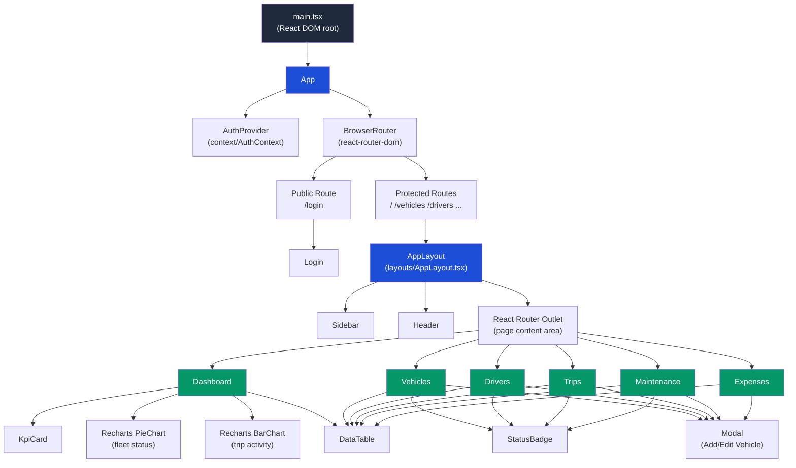
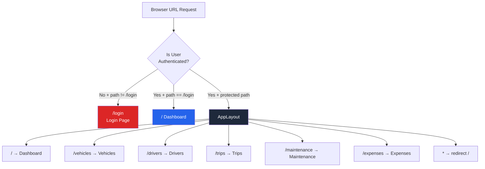
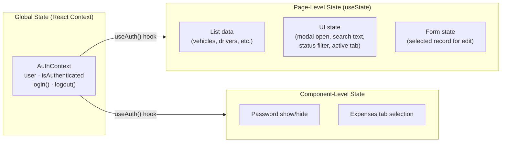
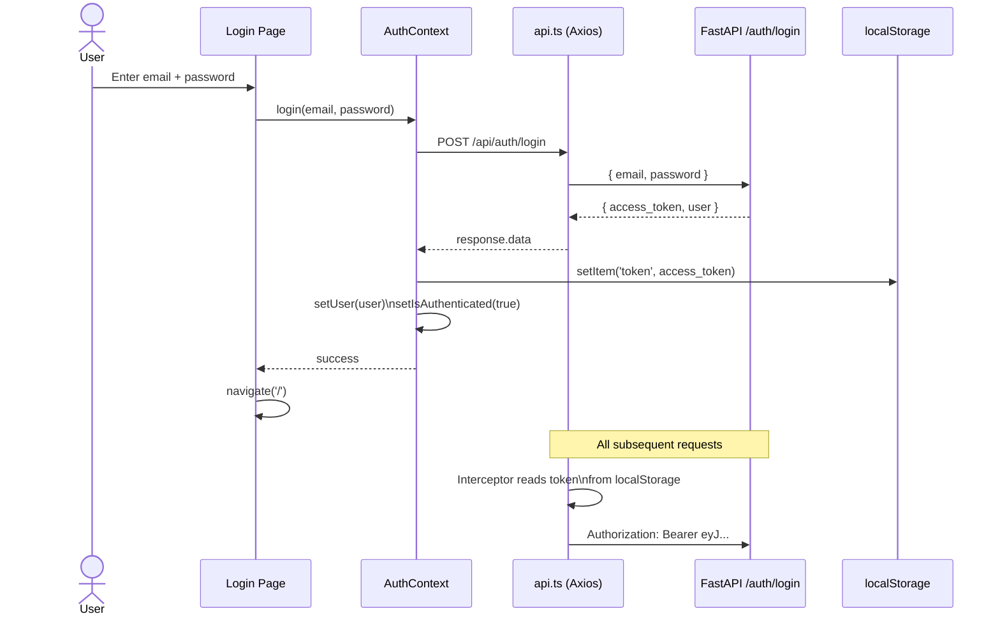
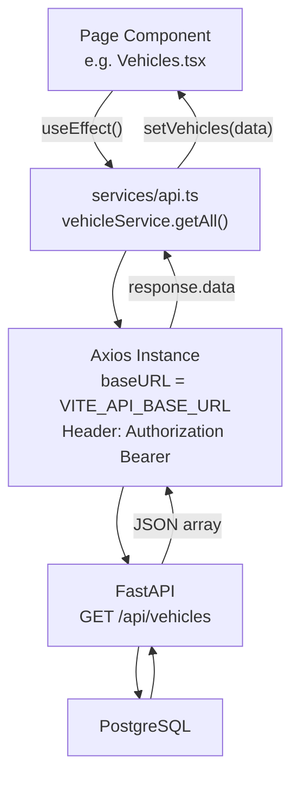
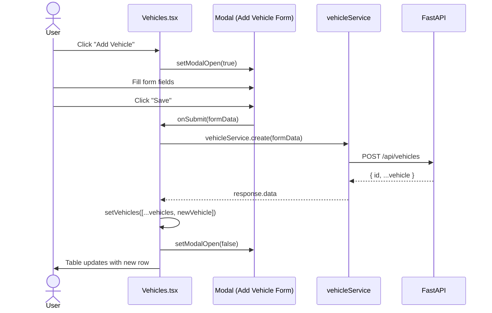
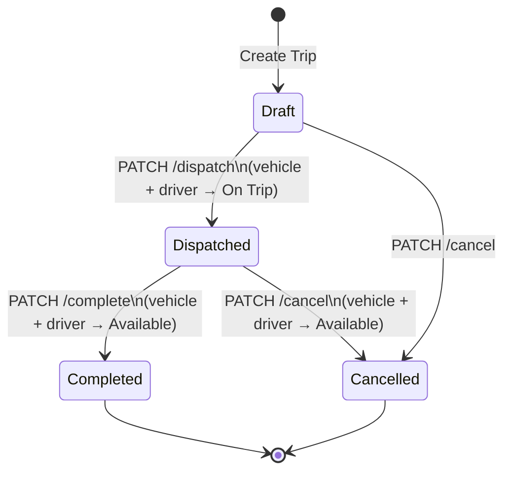

# TransitOps — Frontend Architecture

**Version:** 1.0.0
**Date:** 2026-07-12
**Stack:** React 18 · TypeScript 5 · Vite 5 · Tailwind CSS 3 · React Router 6 · Axios · Recharts · Lucide React

---

## Table of Contents

1. [Overview](#overview)
2. [Folder Structure](#folder-structure)
3. [Component Hierarchy](#component-hierarchy)
4. [Routing Architecture](#routing-architecture)
5. [State Management](#state-management)
6. [Authentication Flow](#authentication-flow)
7. [API Integration Pattern](#api-integration-pattern)
8. [Design System](#design-system)
9. [Data Flow Diagrams](#data-flow-diagrams)
10. [Mock → Real API Migration](#mock--real-api-migration)

---

## 1. Overview

The TransitOps frontend is a **Single Page Application (SPA)** built with React and TypeScript. It communicates exclusively with the FastAPI backend via Axios HTTP calls using JWT Bearer tokens for authentication.

The UI is organized around a **fixed sidebar navigation** and a **scrollable main content area**, giving users access to 6 operational modules: Dashboard, Vehicles, Drivers, Trips, Maintenance, and Expenses.

---

## 2. Folder Structure

```
frontend/src/
│
├── components/          # Shared, reusable UI primitives
│   ├── Sidebar.tsx      # Fixed left navigation bar
│   ├── Header.tsx       # Top bar with page title and user info
│   ├── KpiCard.tsx      # Dashboard metric card
│   ├── DataTable.tsx    # Generic typed table component
│   ├── StatusBadge.tsx  # Colored status pill
│   └── Modal.tsx        # Reusable dialog overlay
│
├── layouts/             # App shell wrappers
│   └── AppLayout.tsx    # Protected layout: Sidebar + Header + Outlet
│
├── context/             # React Context providers
│   └── AuthContext.tsx  # User auth state + login/logout methods
│
├── hooks/               # Custom React hooks
│   └── useAuth.ts       # Consumes AuthContext cleanly
│
├── types/               # TypeScript type definitions
│   └── index.ts         # All interfaces and type aliases (single source of truth)
│
├── data/                # Mock data for development
│   └── mockData.ts      # Realistic placeholder arrays for all entities
│
├── pages/               # Route-level page components
│   ├── Login.tsx        # Public auth page
│   ├── Dashboard.tsx    # KPI cards + charts + recent trips
│   ├── Vehicles.tsx     # Vehicle CRUD with search/filter
│   ├── Drivers.tsx      # Driver CRUD with search/filter
│   ├── Trips.tsx        # Trip management with status actions
│   ├── Maintenance.tsx  # Maintenance record management
│   └── Expenses.tsx     # Fuel logs + other expenses (tabbed)
│
├── services/            # API communication layer
│   └── api.ts           # Axios instance + all service functions
│
├── App.tsx              # Root router (public + protected routes)
├── main.tsx             # React DOM entry point
└── index.css            # Tailwind directives + global styles
```

### Design Principle: Separation of Concerns

| Folder | Responsibility | Who Changes It |
|---|---|---|
| `types/` | Shape of data | Backend integrator |
| `data/` | Mock values | Backend integrator (then deletes) |
| `services/` | HTTP calls | Backend integrator |
| `context/` + `hooks/` | Auth state | Auth owner |
| `components/` | Reusable UI | UI developer |
| `layouts/` | App shell | UI developer |
| `pages/` | Feature logic | Feature developers |

---

## 3. Component Hierarchy



---

## 4. Routing Architecture

React Router v6 manages all navigation with two route groups: **public** and **protected**.



### Route Configuration (App.tsx)

```
Routes
├── /login             → <Login />                  (public)
└── <AppLayout />                                    (protected — checks isAuthenticated)
    ├── /              → <Dashboard />
    ├── /vehicles      → <Vehicles />
    ├── /drivers       → <Drivers />
    ├── /trips         → <Trips />
    ├── /maintenance   → <Maintenance />
    ├── /expenses      → <Expenses />
    └── *              → <Navigate to="/" />
```

**Auth Guard:** `AppLayout` reads `isAuthenticated` from `useAuth()`. If false, it redirects to `/login` using React Router's `<Navigate>` component — no page reload required.

---

## 5. State Management

TransitOps uses **no external state management library** (no Redux, no Zustand). State is managed at three levels:



### Why No Redux?

| Concern | Solution |
|---|---|
| Auth state shared globally | React Context (`AuthContext`) |
| Page data (vehicles list, etc.) | `useState` inside each page |
| Form data | Controlled `useState` inside modals |
| Cross-page data (vehicles list for Trip form) | Import from `mockData.ts` → later from API |

For a hackathon, Context + `useState` is the right tool. Redux would add boilerplate with no benefit at this scale.

---

## 6. Authentication Flow



### Token Storage and Interceptor

```
localStorage
  └── 'token'  →  "eyJhbGciOiJIUzI1NiJ9..."

Axios Interceptor (api.ts)
  ├── Reads token on every request
  └── Injects: Authorization: Bearer <token>

Logout
  ├── localStorage.removeItem('token')
  ├── setUser(null)
  └── setIsAuthenticated(false)
  → Navigate to /login
```

---

## 7. API Integration Pattern

All HTTP communication goes through `src/services/api.ts`. This file has two responsibilities:

1. **Axios Instance** — pre-configured with base URL and JWT interceptor
2. **Service Objects** — named functions per entity (vehicleService, driverService, etc.)



### Service Function Pattern

Every entity follows the same pattern in `api.ts`:

```
vehicleService = {
  getAll(params?)    → GET /vehicles?status=&search=
  getById(id)        → GET /vehicles/{id}
  create(data)       → POST /vehicles
  update(id, data)   → PUT /vehicles/{id}
  updateStatus(id)   → PATCH /vehicles/{id}/status
  delete(id)         → DELETE /vehicles/{id}
}
```

### Page Data Loading Pattern

```typescript
// Every page follows this identical pattern:
const [items, setItems] = useState<Vehicle[]>(mockVehicles) // ← mock now
const [loading, setLoading] = useState(false)
const [error, setError] = useState<string | null>(null)

useEffect(() => {
  // TODO: Replace with real API call:
  // setLoading(true)
  // vehicleService.getAll()
  //   .then(res => setItems(res.data))
  //   .catch(() => setError('Failed to load'))
  //   .finally(() => setLoading(false))
}, [])
```

---

## 8. Design System

### Color Tokens (tailwind.config.js)

| Token | Hex | Usage |
|---|---|---|
| `sidebar-DEFAULT` | `#0F172A` | Sidebar background |
| `sidebar-hover` | `#1E293B` | Sidebar nav item hover |
| `sidebar-active` | `#1D4ED8` | Active nav item |
| `primary-DEFAULT` | `#2563EB` | Buttons, links, accents |
| `primary-hover` | `#1D4ED8` | Button hover state |
| `primary-light` | `#EFF6FF` | Highlighted backgrounds |
| `surface` | `#F8FAFC` | Page background |
| White | `#FFFFFF` | Cards |
| `slate-200` | `#E2E8F0` | Borders |
| `slate-500` | `#64748B` | Muted text |

### Typography

| Element | Class | Size | Weight |
|---|---|---|---|
| Page title | `.page-title` | 24px | SemiBold 600 |
| Section heading | `text-lg font-semibold` | 18px | SemiBold 600 |
| Body text | `text-sm` | 14px | Regular 400 |
| Label | `.form-label` | 14px | Medium 500 |
| Badge | `text-xs font-medium` | 12px | Medium 500 |

### Status Badge Color Map

| Status | Background | Text | Used By |
|---|---|---|---|
| Available | `bg-green-100` | `text-green-700` | Vehicle, Driver |
| On Trip | `bg-blue-100` | `text-blue-700` | Vehicle, Driver |
| Active | `bg-green-100` | `text-green-700` | Maintenance |
| Completed | `bg-green-100` | `text-green-700` | Trip, Maintenance |
| Dispatched | `bg-blue-100` | `text-blue-700` | Trip |
| Draft | `bg-amber-100` | `text-amber-700` | Trip |
| Off Duty | `bg-amber-100` | `text-amber-700` | Driver |
| In Shop | `bg-amber-100` | `text-amber-700` | Vehicle |
| Retired | `bg-red-100` | `text-red-700` | Vehicle |
| Suspended | `bg-red-100` | `text-red-700` | Driver |
| Cancelled | `bg-red-100` | `text-red-700` | Trip |

### Reusable CSS Classes (index.css)

| Class | Purpose |
|---|---|
| `.btn-primary` | Blue filled action button |
| `.btn-secondary` | White outlined secondary button |
| `.btn-danger` | Red destructive action button |
| `.form-input` | Styled text/select input |
| `.form-label` | Input label above field |
| `.card` | White rounded shadow container |
| `.page-container` | Page padding and spacing |
| `.page-header` | Row with title on left, button on right |
| `.page-title` | 2xl semibold heading |

---

## 9. Data Flow Diagrams

### CRUD Flow (e.g., Add Vehicle)



### Trip Status Transition Flow



---

## 10. Mock → Real API Migration

The frontend is designed so that replacing mock data with real API calls requires **minimal changes per page**. Here is the exact pattern:

### Step 1 — Replace useState initialization

```typescript
// BEFORE (mock)
import { mockVehicles } from '../data/mockData'
const [vehicles, setVehicles] = useState<Vehicle[]>(mockVehicles)

// AFTER (real API)
const [vehicles, setVehicles] = useState<Vehicle[]>([])
```

### Step 2 — Uncomment the useEffect API call

```typescript
// AFTER (real API)
useEffect(() => {
  setLoading(true)
  vehicleService.getAll()
    .then(res => setVehicles(res.data))
    .catch(() => setError('Failed to load vehicles'))
    .finally(() => setLoading(false))
}, [])
```

### Step 3 — Wire Create/Update/Delete buttons

```typescript
// BEFORE (mock — updates local state only)
const handleAdd = (data: VehicleCreate) => {
  setVehicles(prev => [...prev, { id: Date.now(), ...data }])
}

// AFTER (real API)
const handleAdd = async (data: VehicleCreate) => {
  const res = await vehicleService.create(data)
  setVehicles(prev => [...prev, res.data])
}
```

### Step 4 — Replace AuthContext mock login

```typescript
// BEFORE (mock login — accepts any non-empty credentials)
const login = (email: string) => {
  setUser({ email, full_name: 'Admin', id: 1, is_active: true })
  setIsAuthenticated(true)
}

// AFTER (real API)
const login = async (email: string, password: string) => {
  const res = await api.post<LoginResponse>('/auth/login', { email, password })
  localStorage.setItem('token', res.data.access_token)
  setUser(res.data.user)
  setIsAuthenticated(true)
}
```

### Migration Checklist

| Page | useState mock → API | Create | Update | Delete | Status Action |
|---|---|---|---|---|---|
| Login.tsx | AuthContext.login() | — | — | — | — |
| Dashboard.tsx | dashboardService.getStats() | — | — | — | — |
| Vehicles.tsx | vehicleService.getAll() | ✓ | ✓ | ✓ | ✓ |
| Drivers.tsx | driverService.getAll() | ✓ | ✓ | ✓ | ✓ |
| Trips.tsx | tripService.getAll() | ✓ | — | — | dispatch/complete/cancel |
| Maintenance.tsx | maintenanceService.getAll() | ✓ | ✓ | ✓ | complete |
| Expenses.tsx | expenseService.getFuelLogs() expenseService.getExpenses() | ✓ | — | ✓ | — |

---

## Appendix: Component Props Reference

### KpiCard

| Prop | Type | Required | Description |
|---|---|---|---|
| `title` | `string` | ✓ | Card label |
| `value` | `number \| string` | ✓ | Main metric |
| `icon` | `React.ReactNode` | ✓ | Lucide icon element |
| `color` | `string` | ✓ | Tailwind color class (e.g. `text-blue-600`) |
| `subtitle` | `string` | — | Secondary label below value |

### DataTable

| Prop | Type | Required | Description |
|---|---|---|---|
| `columns` | `Column<T>[]` | ✓ | Column definitions |
| `data` | `T[]` | ✓ | Row data array |
| `emptyMessage` | `string` | — | Text when data is empty |

### StatusBadge

| Prop | Type | Required | Description |
|---|---|---|---|
| `status` | `VehicleStatus \| DriverStatus \| TripStatus \| MaintenanceStatus` | ✓ | Status string |

### Modal

| Prop | Type | Required | Description |
|---|---|---|---|
| `isOpen` | `boolean` | ✓ | Controls visibility |
| `onClose` | `() => void` | ✓ | Called on close/backdrop click |
| `title` | `string` | ✓ | Modal header title |
| `children` | `React.ReactNode` | ✓ | Form content |
