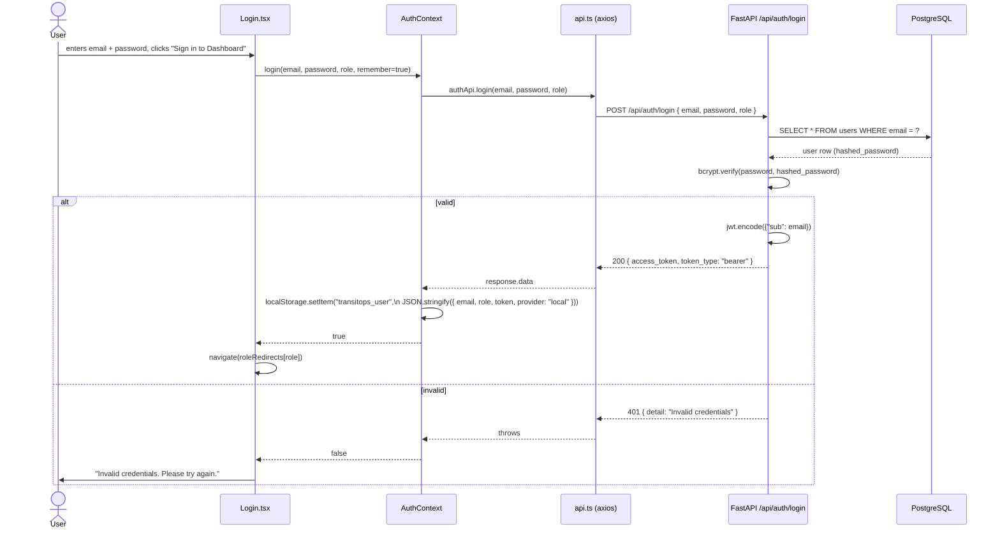
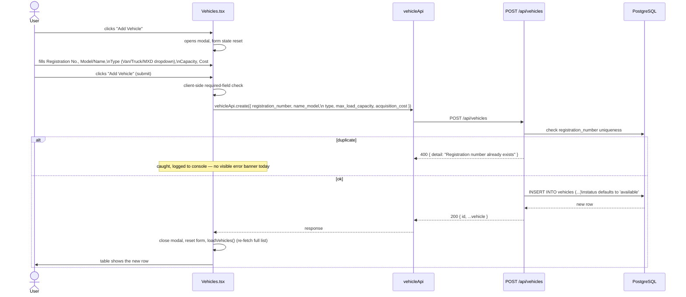
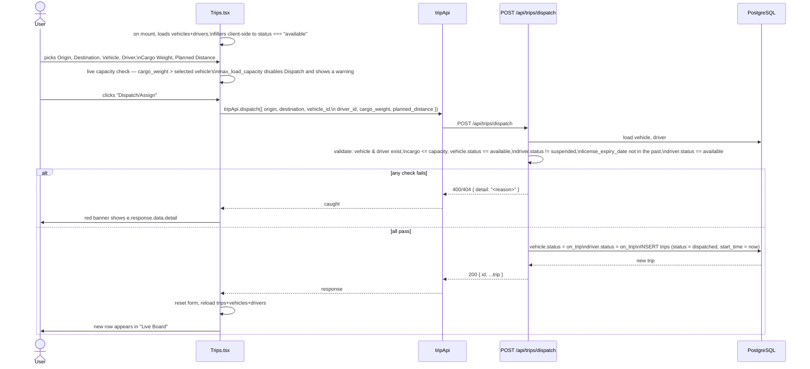

# TransitOps — How The Application Works

**Version:** 1.0.0
**Date:** 2026-07-12
**Audience:** anyone picking up this codebase for the first time — traces one real user session end to end.

This document complements the others in `docs/`: `ARCHITECTURE.md` explains *why* the system is shaped the
way it is, `BACKEND.md`/`FRONTEND.md`/`DATABASE.md` describe each layer in isolation, and `API.md` is the
endpoint reference. This document instead walks through **what actually happens, in order**, when a fleet
manager uses the app — boot, login, and one full pass through every page.

---

## 1. Starting the application

Two processes, run independently:

```bash
# Terminal 1 — backend
cd backend
uvicorn app.main:app --reload --port 8000

# Terminal 2 — frontend
cd frontend
npm run dev
```

On backend startup, `main.py`'s `on_startup()` hook calls `init_db()` (`app/db/init_db.py`), which:

1. Creates any tables that don't exist yet (`Base.metadata.create_all()` — never alters existing tables)
2. Seeds `regions`, `vehicle_types`, `license_categories` if those tables are empty
3. Seeds one admin user (`admin@transitops.com` / `admin123`), one vehicle (`KA-01-AB-1234`), and one driver
   (`Ramesh Kumar`) if those tables are empty

This means **the app is usable immediately after `uvicorn` starts** — no manual seed step required — and
restarting the backend is always safe (it won't duplicate or wipe existing data).

The frontend (Vite) needs no backend proxy configuration: `src/services/api.ts` defaults its Axios
`baseURL` to `http://localhost:8000/api` when `VITE_API_BASE_URL` isn't set in `frontend/.env`.

---

## 2. Login



Notes on what's real vs. cosmetic here:

- The `role` field (Fleet Manager / Dispatcher / Safety Officer / Financial Analyst) is sent to the backend
  but **ignored** by `login()` — it only exists client-side to pick which page `roleRedirects` sends the
  user to after login, and to display a role chip in the header.
- The **Google / Microsoft OAuth buttons** are fully mocked (`AuthContext.mockOAuthLogin`) — clicking one
  waits 800ms then fabricates a session with a hardcoded email and a non-JWT `token` string, no network
  request involved. This works today because no backend route validates the token, but see the caveat in
  §7 below.
- "Remember me" (passed as `true` from the main sign-in button, there's no visible checkbox) decides
  `localStorage` (persists across browser restarts) vs. `sessionStorage` (cleared on tab close).

---

## 3. The authenticated shell

Once `isAuthenticated` is true (i.e. `transitops_user` exists in storage and `AuthContext` has loaded it on
mount), every route under `/dashboard`, `/vehicles`, `/drivers`, `/trips`, `/maintenance`, `/expenses`, and
`/settings` renders inside `AppLayout`:

```
AppLayout
├── Sidebar   — nav links (icon + label) to all 7 pages, current user's email/role, "Log out"
├── Header    — search box (non-functional placeholder) + role chip
└── <Outlet/> — the active page component
```

Every one of those 7 pages independently calls the API it needs in a `useEffect` on mount — there is no
shared data-fetching layer or cache; navigating between pages always re-fetches fresh data.

`Log out` calls `AuthContext.logout()` (clears both storages, clears `user` state) then navigates to
`/login`. It does **not** call any backend endpoint — logout is purely a client-side state clear.

---

## 4. Dashboard

`Dashboard.tsx` fires three requests in parallel on mount:

| Call | Feeds |
|---|---|
| `GET /api/analytics/dashboard` | 5 KPI cards: active vehicles, vehicles in maintenance, active trips, pending trips, drivers on duty |
| `GET /api/trips` | "Recent Trips" table (client-side sliced to the first 5) |
| `GET /api/vehicles` | "Vehicle Status" breakdown bars (grouped client-side by `status`) |

All three are computed fresh on every page load — there's no dashboard-specific aggregation endpoint beyond
`/analytics/dashboard`; the fleet-status breakdown is derived in the browser from the full vehicle list.

---

## 5. Registering a vehicle (Vehicles page)

This is the canonical "Add X" flow — Drivers, Trips, Maintenance, and Expenses all follow the same shape.



The **Type** field is a hardcoded dropdown (`Van` / `Truck` / `MXD`), stored as a plain string on the
`vehicles.type` column — it is not linked to the `vehicle_types` lookup table (see `DATABASE.md` §7). The
new vehicle has no `region_id` (the form doesn't collect one; the column is nullable) and starts with
`odometer: 0`.

There is currently no way to edit or delete a vehicle from the UI or the API once created.

---

## 6. Registering a driver (Drivers page)

Same shape as vehicles: `POST /api/drivers` with `first_name`, `last_name`, `license_number`,
`license_category` (free-text dropdown: LMV/HMV/Two Wheeler), `license_expiry_date`, `contact_number`.
`safety_score` defaults to `100` server-side (not collected by the form) and `status` defaults to
`available`. No edit/delete exists here either.

---

## 7. Dispatching a trip (Trips page)

This is the one flow with real cross-entity business logic. Unlike the other pages, there is no separate
"create a draft, then dispatch it" step — one form submission does both:



Once dispatched, a trip can only move forward via `PUT /api/trips/{id}/status?status=completed` or
`?status=cancelled` — both reset the linked vehicle and driver back to `available`. **The frontend has no
button for either action yet**; those transitions are only reachable through Swagger UI (`/docs`) or a
direct API call today.

---

## 8. Logging maintenance (Maintenance page)

`POST /api/maintenance` with `vehicle_id`, `date` (defaults to today, not user-editable), `type`
(`routine`/`repair`/`inspection` dropdown), `cost`, `description`. Creating a record with the default
status (`active`) has a side effect: **the linked vehicle's status flips to `in_shop`**, which is why it
then disappears from the "available" dropdowns on the Trips and Vehicles pages.

Clicking **"Mark Done"** next to an `active` record calls
`PUT /api/maintenance/{id}/status?status=completed`, which flips the vehicle back to `available` and the
record's status to `completed`.

---

## 9. Logging fuel and expenses (Expenses page)

Two independent forms on one page, both following the same create-then-refetch pattern:

- **Log Fuel** → `POST /api/expenses/fuel` — `vehicle_id`, `gallons` (labeled "Litres" in the UI, sent as
  `gallons` to match the backend column), `cost`, `date` (today).
- **Add Expense** → `POST /api/expenses` — `trip_id` (picked from a dropdown of all trips), `type`
  (`toll`/`parking`/`fine`/`other`), `amount`, `description`, `date` (today).

Neither has an edit or delete action. The three KPI tiles at the top (Total Fuel Cost, Other Expenses,
Total Operational Cost) are summed client-side from whatever `GET /api/expenses/fuel` and `GET /api/expenses`
currently return — there's no server-side aggregation.

---

## 10. Settings — the one page that doesn't do anything yet

`Settings.tsx` renders Profile and Security tabs with real form inputs, but its submit handler only shows a
browser `alert("Settings saved successfully!")` — no API call is made, no backend route exists to receive
one. Anything typed here is lost on refresh. See `FRONTEND.md` §11.

---

## 11. What happens on error, end to end

| Failure point | What the user sees |
|---|---|
| Backend unreachable (not running, wrong port) | Axios rejects; every page's `catch (e) { console.error(e) }` swallows it silently — the page just shows an empty table with no loading/error state. There is no global "backend offline" banner. |
| `422` validation error (bad payload shape) | Same as above on most pages — swallowed to console. Only `Trips.tsx` surfaces `e.response.data.detail` to the user in a visible red banner. |
| `401` from any request | The Axios response interceptor clears both storages and hard-redirects (`window.location.href`) to `/login`. In practice this rarely fires today because no route currently checks the token (see below). |
| Duplicate registration number / email | Backend returns `400` with a human-readable `detail`; on the Vehicles/Login forms this is currently only logged to console, not shown, except Login's own credential-check messaging. |

---

## 12. Security model, honestly

Worth stating plainly rather than leaving implicit: **the API is not currently access-controlled.** JWTs are
issued correctly on login/register and bcrypt password hashing is real, but:

- No router applies `Depends(get_current_user)`, so every `/api/vehicles`, `/api/drivers`, `/api/trips`,
  `/api/maintenance`, `/api/expenses`, and `/api/analytics` endpoint is reachable by anyone who can reach
  port 8000, token or not.
- Issued JWTs carry no `exp` claim, so even a legitimate token never expires.
- The mock OAuth buttons fabricate a session with a token string that isn't a valid JWT at all — harmless
  today only because nothing checks it.

This is fine for local development and demoing the UI, but **must be closed before any real deployment** —
wiring `get_current_user` into each router and adding an `exp` claim to token creation are the two concrete
fixes (tracked in `BACKEND.md` §15).

---

## 13. Quick reference: page → backend calls

| Page | On load | On submit |
|---|---|---|
| Login | — | `POST /auth/login` or `POST /auth/register` |
| Dashboard | `GET /analytics/dashboard`, `GET /trips`, `GET /vehicles` | — |
| Vehicles | `GET /vehicles` | `POST /vehicles` |
| Drivers | `GET /drivers` | `POST /drivers` |
| Trips | `GET /trips`, `GET /vehicles`, `GET /drivers` | `POST /trips/dispatch` |
| Maintenance | `GET /maintenance`, `GET /vehicles` | `POST /maintenance`, `PUT /maintenance/{id}/status` |
| Expenses | `GET /expenses/fuel`, `GET /expenses`, `GET /vehicles`, `GET /trips` | `POST /expenses/fuel`, `POST /expenses` |
| Settings | — | none (UI only) |
